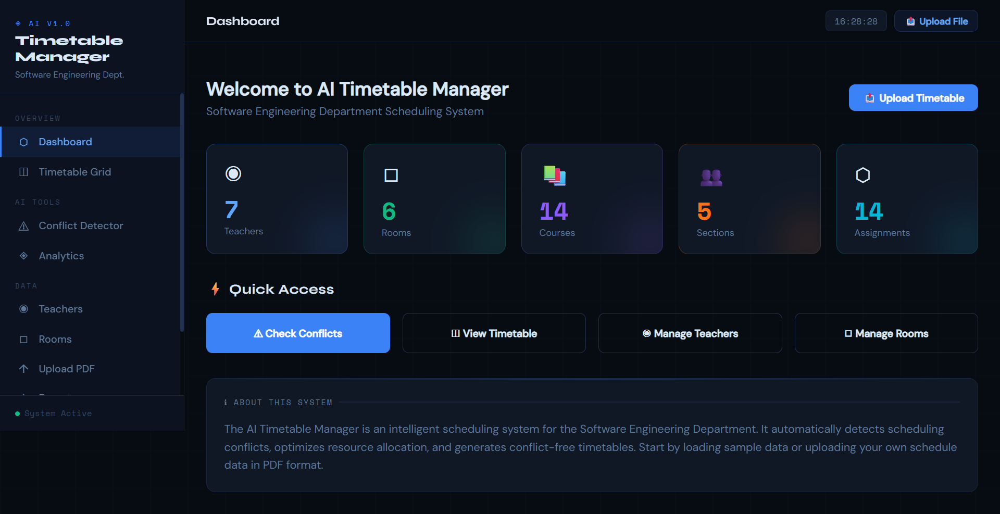
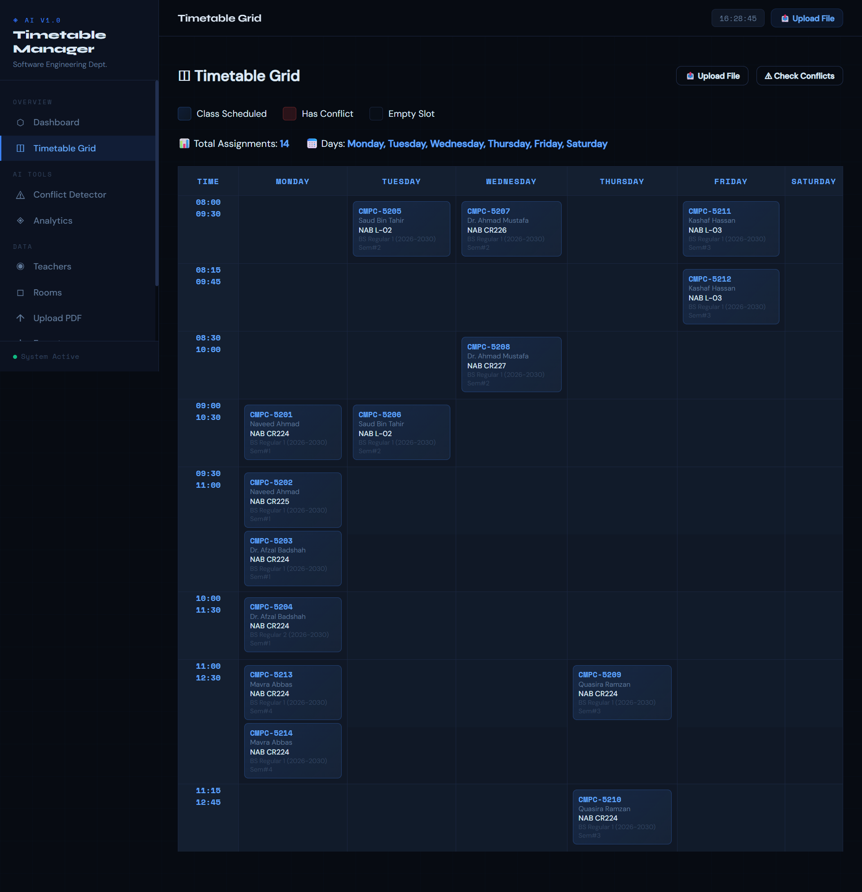
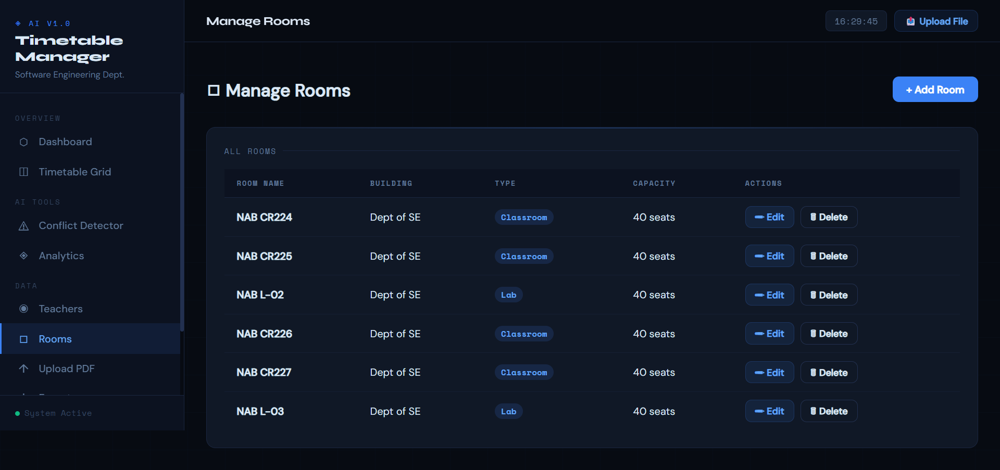
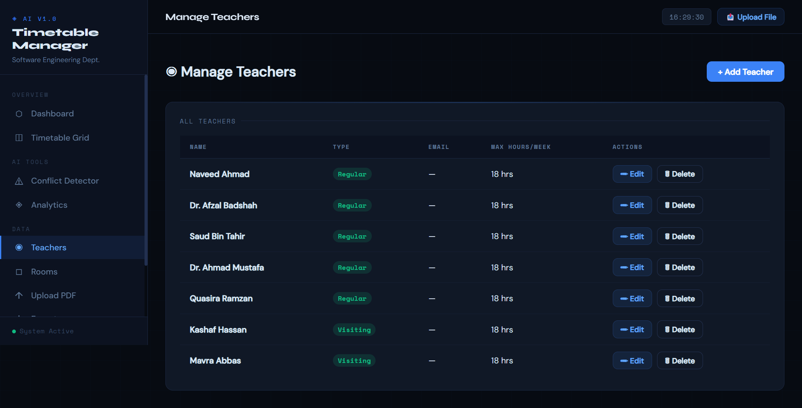
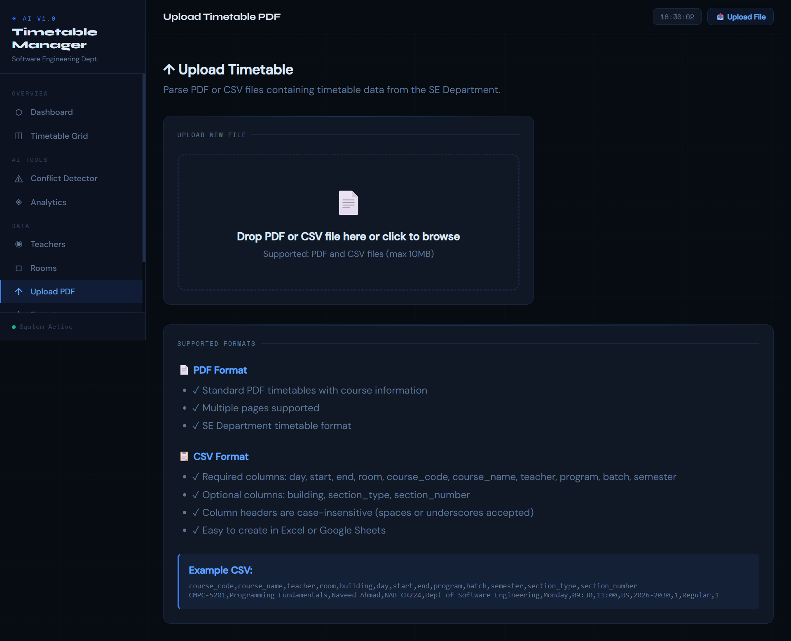
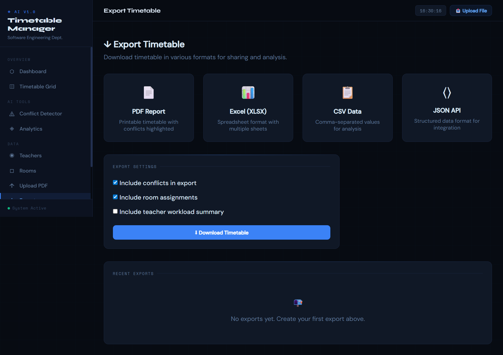
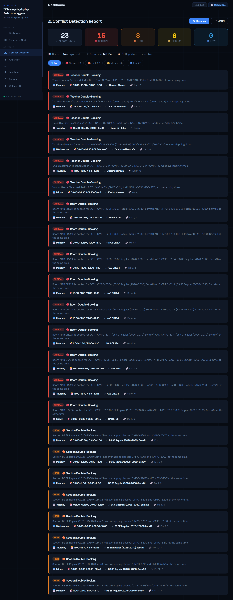

# 🤖 AI Timetable System v1.0


A Flask-based web application designed to automatically parse, manage, and detect conflicts in university timetables. Built specifically for the Software Engineering Department.

---

## 🚀 Features

- **Upload-Driven Architecture:** Upload timetable data via PDF or CSV files  
- **Smart Parsing:** Extracts courses, teachers, rooms, and sections using regex-based parsing  
- **Advanced Conflict Detection:**
  - Teacher Double-Booking  
  - Room Double-Booking  
  - Section Double-Booking  
  - Skips combined classes intelligently  
- **Interactive Timetable Grid:** Clean weekly visual layout  
- **Dashboard & Analytics:** Overview of all scheduling entities  

---

## 🛠 Tech Stack

- **Backend:** Python, Flask, SQLAlchemy (SQLite)  
- **Frontend:** HTML5, CSS3, Jinja2  
- **PDF Parsing:** pdfplumber  

---

## 📸 UI Preview

### 🏠 Dashboard
Overview of system analytics and conflicts.



---

### 📅 Timetable View
Visual weekly grid of all scheduled classes.



---

### 🏫 Rooms Management
Manage and view all rooms.



---

### 👨‍🏫 Teachers Management
Manage teacher data and assignments.



---

### ⬆️ Upload System
Upload timetable via PDF or CSV.



---

### 📤 Export Feature
Export timetable data.



---

### ⚠️ Conflict Detection
Automatically detects scheduling conflicts:
- Teacher clashes  
- Room clashes  
- Section overlaps  



---

## ⚙️ Setup & Installation

### 1️⃣ Clone the repository
```bash
git clone <repository-url>
cd ai_timetable
````

### 2️⃣ Create virtual environment

```bash
python -m venv venv
```

#### Activate environment:

**Windows**

```bash
venv\Scripts\activate
```

**macOS/Linux**

```bash
source venv/bin/activate
```

---

### 3️⃣ Install dependencies

```bash
pip install -r requirements.txt
```

---

### 4️⃣ Run the application

```bash
python run.py
```

---

### 5️⃣ Open in browser

```
http://127.0.0.1:5000
```

---

## 📖 Usage Guide

1. Go to the **Upload** page
2. Upload timetable file (.pdf or .csv)
3. System parses and stores data automatically
4. Visit **Conflicts** page to detect issues
5. Use **Timetable** page for visual schedule

---

## 📊 Project Structure

```
ai_timetable/
│── app/
│── images/
│── static/
│── templates/
│── run.py
│── requirements.txt
│── README.md
```

---

## 🎯 Future Improvements

* AI-based timetable optimization
* Drag & drop timetable editor
* User authentication system
* Export to Excel / PDF formats
* Real-time conflict suggestions

---

## 👨‍💻 Author

**Abdul Wahab Javed**
Software Engineering Student

---

## 📌 Version

**v1.0** – Initial stable release with:

* PDF/CSV upload
* Parsing engine
* Conflict detection
* Dashboard analytics

---

## ⭐ Support

If you like this project, consider giving it a star ⭐ on GitHub!

```

---

## 🔥 What you achieved with this
- Looks **final year project level**
- Clean + professional structure  
- Strong for **CV / GitHub portfolio**
- Easy for teacher to understand  

---

If you want next level:
- Add **demo video (GIF)**  
- Add **live hosted link (Render / Railway)**  
- Add **architecture diagram**

Just tell me, I’ll help you upgrade it further 🚀
```
